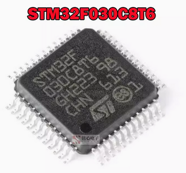

.. _stm32f030c8t6:

ST STM32F030C8T6
##########################

Overview
********

The GD32F407ZGT6-NAVIGATOR board is a hardware platform that enables prototyping
on GD32F407VE Cortex-M4 High Performance MCU.

The GD32F407VE features a single-core ARM Cortex-M4 MCU which can run up
to 168 MHz with flash accesses zero wait states, 3072kiB of Flash, 192kiB of
SRAM and 82 GPIOs.

Hardware
********

- GD32F407VET6 MCU
- 1 x User LEDs
- 1 x User Push buttons
- 1 x USART
- GD-Link on board programmer
- J-Link/SWD connector

For more information about the GD32F407 SoC and GD32F407ZGT6-NAVIGATOR board:

- `GigaDevice Cortex-M4 High Performance SoC Website`_
- `GD32F407X Datasheet`_
- `GD32F40X User Manual`_
- `GD32F407ZGT6-NAVIGATOR User Manual`_

Supported Features
==================

The board configuration supports the following hardware features:

.. list-table::
   :header-rows: 1

   * - Peripheral
     - Kconfig option
     - Devicetree compatible
   * - EXTI
     - :kconfig:option:`CONFIG_GD32_EXTI`
     - :dtcompatible:`gd,gd32-exti`
   * - GPIO
     - :kconfig:option:`CONFIG_GPIO`
     - :dtcompatible:`gd,gd32-gpio`
   * - NVIC
     - N/A
     - :dtcompatible:`arm,v7m-nvic`
   * - PWM
     - :kconfig:option:`CONFIG_PWM`
     - :dtcompatible:`gd,gd32-pwm`
   * - SYSTICK
     - N/A
     - N/A
   * - USART
     - :kconfig:option:`CONFIG_SERIAL`
     - :dtcompatible:`gd,gd32-usart`

Other peripherals may be used if shields are connected to the board.

Serial Port
===========

The GD32F407ZGT6-NAVIGATOR board has one serial communication port. The default port
is USART0 with TX connected at PA9 and RX at PA10.

Programming and Debugging
*************************

Before programming your board make sure to configure boot jumpers as
follows:

- JP3/4: Select 2-3 for both (boot from user memory)

Using GD-Link or J-Link
=======================

The board comes with an embedded GD-Link programmer.
You need to install CMSIS-Pack which is required by pyOCD
when programming or debugging by the GD-Link programmer.
Execute the following command to install CMSIS-Pack for GD32F407VK
if not installed yet.

   .. code-block:: console

      pyocd pack install gd32f407vk

Also, J-Link can be used to program the board via the SWD interface
(PA13/SWDIO and PA14/SWCLK in the JP6 header).

#. Build the Zephyr kernel and the :ref:`hello_world` sample application:

   .. zephyr-app-commands::
      :zephyr-app: samples/hello_world
      :board: stm32f030c8t6
      :goals: build
      :compact:

#. Connect Serial-USB adapter to PA9, PA10, and GND.

#. Run your favorite terminal program to listen for output. On Linux the
   terminal should be something like ``/dev/ttyUSB0``. For example:

   .. code-block:: console

      minicom -D /dev/ttyUSB0 -o

   The -o option tells minicom not to send the modem initialization
   string. Connection should be configured as follows:

      - Speed: 115200
      - Data: 8 bits
      - Parity: None
      - Stop bits: 1

#. To flash an image:

   .. zephyr-app-commands::
      :zephyr-app: samples/hello_world
      :board: stm32f030c8t6
      :goals: flash
      :compact:

   When using J-Link, append ``--runner jlink`` option after ``west flash``.

   You should see "Hello World! stm32f030c8t6" in your terminal.

#. To debug an image:

   .. zephyr-app-commands::
      :zephyr-app: samples/hello_world
      :board: stm32f030c8t6
      :goals: debug
      :compact:

   When using J-Link, append ``--runner jlink`` option after ``west debug``.

.. _GigaDevice Cortex-M4 High Performance SoC Website:
   https://www.gigadevice.com/products/microcontrollers/gd32/arm-cortex-m4/high-performance-line/

.. _GD32F407X Datasheet:
   https://gd32mcu.com/data/documents/datasheet/GD32F407xx_Datasheet_Rev2.5.pdf

.. _GD32F40X User Manual:
   https://gd32mcu.com/data/documents/userManual/GD32F4xx_User_Manual_Rev2.7.pdf
